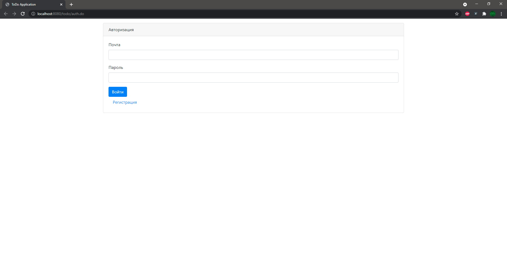

# Проект "TODO list" - "Список дел"
MVC приложение, реализующее функционал по ведению списка дел.
# Функционал:
- Регистрация пользователей, авторизация и 
  аутентификация с использованием фильтра.
- Добавление дел, проставление отметок о выполнении.
- По каждому делу учитывается: пользователь, категории дела, дата создания.
- Возможность отображения всех дел или только невыполненных.
# Применяемые технологии:
- HTML, CSS, Bootstrap, JavaScript, AJAX
- JSP, Servlets, Apache Tomcat
- Hibernate, Postgresql
- Maven, Travis CI, Codecov, Checkstyle 

